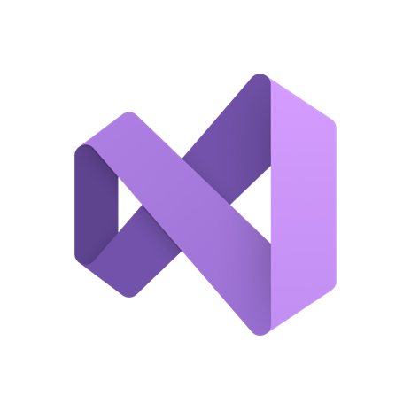

# CURSO DE VISUAL STUDIO 2022
👨‍⚖️O VISUAL STUDIO 2022 É UMA VERSÃO DO AMBIENTE DE DESENVOLVIMENTO INTEGRADO (IDE) DA MICROSOFT, UTILIZADO PRINCIPALMENTE PARA DESENVOLVIMENTO DE SOFTWARE. ELE OFERECE FERRAMENTAS E RECURSOS PARA PROGRAMAÇÃO, DEPURAÇÃO, TESTE E IMPLANTAÇÃO DE APLICATIVOS EM VÁRIAS PLATAFORMAS.

  

## CONCEITO:
O Visual Studio 2022 é a versão mais recente do ambiente de desenvolvimento integrado (IDE) da Microsoft. Este ambiente é utilizado para o desenvolvimento de software em várias linguagens de programação, como C#, VB.NET, C++, F#, Python, entre outras.

Algumas características notáveis do Visual Studio 2022 incluem:

1. **Suporte a Multiplataforma:** Permite o desenvolvimento de aplicativos para Windows, Web, Android, iOS e outras plataformas.

2. **Integração com .NET 6:** Oferece suporte à versão mais recente do framework .NET, que é uma estrutura de desenvolvimento da Microsoft para criar aplicativos para diferentes plataformas.

3. **Melhorias na Performance:** O Visual Studio 2022 foi projetado para oferecer uma experiência de desenvolvimento mais rápida e eficiente.

4. **Ferramentas de IA e Machine Learning:** Integração de ferramentas que utilizam inteligência artificial e aprendizado de máquina para melhorar a produtividade do desenvolvedor.

5. **Colaboração em Equipe:** Integração com sistemas de controle de versão como o Git, facilitando o trabalho colaborativo entre desenvolvedores.

6. **Suporte a Tecnologias Modernas:** Oferece suporte às mais recentes tecnologias e padrões de desenvolvimento, como ASP.NET Core, Xamarin, Docker, e mais.

7. **Ambiente de Desenvolvimento Unificado:** Fornece um ambiente integrado que inclui editor de código, depurador, designer de interface gráfica, ferramentas de teste e outras funcionalidades essenciais.

## SUA HISTÓRIA:
Sua história remonta ao lançamento da primeira versão em 1997, originalmente chamada de Visual Studio 97. Desde então, o Visual Studio passou por várias iterações e melhorias significativas ao longo dos anos.

Cada versão do Visual Studio trouxe novos recursos, ferramentas e aprimoramentos para atender às necessidades em constante evolução dos desenvolvedores de software. Algumas das versões mais notáveis incluem:

1. **Visual Studio 2005:** Introduziu suporte para desenvolvimento de aplicativos .NET Framework 2.0 e trouxe melhorias significativas no desenvolvimento web com o ASP.NET 2.0.

2. **Visual Studio 2008:** Adicionou suporte para o desenvolvimento de aplicativos com o .NET Framework 3.5 e introduziu o Windows Presentation Foundation (WPF) e o Windows Communication Foundation (WCF).

3. **Visual Studio 2010:** Introduziu uma nova interface de usuário com a adição da faixa de opções, bem como suporte aprimorado para desenvolvimento de aplicativos Silverlight e Windows Phone.

4. **Visual Studio 2012:** Trouxe uma nova experiência de desenvolvimento com o Visual Studio Express para Windows 8 e suporte para o desenvolvimento de aplicativos Windows Store.

5. **Visual Studio 2013:** Introduziu suporte para o desenvolvimento de aplicativos para o Windows 8.1, bem como melhorias no desenvolvimento web com o ASP.NET MVC 5 e o Web API 2.

6. **Visual Studio 2015:** Marcou o lançamento do Visual Studio Community, uma edição gratuita do Visual Studio com suporte para extensões. Também introduziu o Visual Studio Code, um editor de código multiplataforma.

7. **Visual Studio 2017:** Trouxe melhorias significativas no desempenho do IDE, suporte para o desenvolvimento de aplicativos móveis com o Xamarin e integração aprimorada com o Git.

8. **Visual Studio 2019:** Introduziu o Visual Studio Online, uma plataforma de desenvolvimento baseada em nuvem, bem como melhorias na produtividade, depuração e colaboração em equipe.

## CARACTERISTICAS:
### POSITIVAS:
1. **Interface Amigável:** O Visual Studio 2022 mantém a tradição de oferecer uma interface de usuário intuitiva e amigável, facilitando o desenvolvimento de software.

2. **Suporte Multilinguagem:** Oferece suporte a várias linguagens de programação, como C#, C++, F#, Python, e outras, tornando-o uma escolha versátil para desenvolvedores que trabalham com diferentes tecnologias.

3. **Ferramentas Integradas:** Vem com uma ampla variedade de ferramentas integradas, como depurador, editor de código avançado, e recursos para controle de versão, que facilitam o desenvolvimento e a manutenção do código.

4. **Suporte a Plataformas Diversas:** Permite o desenvolvimento de aplicativos para uma variedade de plataformas, incluindo Windows, Android, iOS, e desenvolvimento web.

5. **Integração com Azure:** Oferece integração aprimorada com os serviços da Microsoft Azure, simplificando o desenvolvimento, teste e implantação de aplicativos na nuvem.

6. **Atualizações Frequentes:** A Microsoft costuma fornecer atualizações regulares, incluindo novos recursos, melhorias de desempenho e correções de bugs, mantendo a ferramenta atualizada.

### NEGATIVAS:
1. **Requisitos de Sistema:** Pode exigir hardware mais robusto, especialmente ao lidar com projetos grandes, o que pode ser um desafio para desenvolvedores com sistemas mais antigos.

2. **Tamanho de Instalação:** O Visual Studio 2022 é conhecido por ser uma aplicação pesada, ocupando considerável espaço em disco durante a instalação.

3. **Personalização Complexa:** Embora seja altamente personalizável, a configuração avançada da IDE pode ser complexa para iniciantes e pode levar algum tempo para se acostumar.

4. **Licenciamento:** A versão completa do Visual Studio 2022 pode ser cara para desenvolvedores individuais, embora haja opções mais leves e gratuitas, como o Visual Studio Code.

5. **Performance em Projetos Grandes:** Ao lidar com projetos muito grandes, alguns desenvolvedores podem enfrentar lentidão na inicialização e na execução, embora melhorias constantes sejam implementadas nas atualizações.

## SUBSIDIOS:
- [CURSO CRIADO PELO "INFORMÁTICA Y PROGRAMACIÓN"](https://youtube.com/playlist?list=PLpQCWggDn8Sx3T2jjN6utkVl-he7JGDxO&si=CGQ4yPQhbsuJhOi5)
- [CURSO FEITO PELO VILHALVA](https://github.com/VILHALVA)
- [VEJA A DOCUMENTAÇÃO](https://learn.microsoft.com/en-us/visualstudio/windows/?view=vs-2022)
- [LINGUAGEM DE PROGRAMAÇÃO](https://github.com/VILHALVA/CURSO-DE-C-SHARP)
- [VEJA A SINTAXE](./SINTAXE.md)

